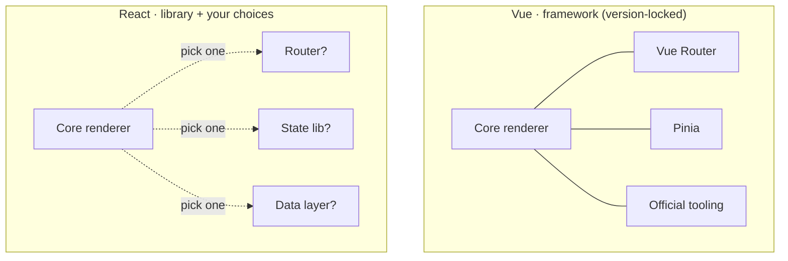

# Module 1: Architectural Philosophies & Ecosystem Dynamics

The fundamental divergence between Vue and React begins at the highest level — the ecosystem itself, not the syntax. Vue is a *progressively opinionated framework*: it scales down to a single script tag like jQuery, and scales up with a cohesive, batteries-included official toolchain. React is, strictly, an *unopinionated UI rendering library*. That one distinction has profound second-order effects on architecture, technical-debt accumulation, and long-term team velocity.

By reported 2026 figures React holds a dominant developer-usage share (~44.7%, entrenched in fintech and large corporate apps) while Vue holds a respected, growing share (~17.6%, often scoring higher on developer experience and onboarding). The gap is not a raw-performance verdict — Vue frequently wins on baseline init and memory — but a reflection of enterprise backing and ecosystem gravity.

## 1. The Library-vs-Framework Dichotomy

When you scaffold a large Vue app, the big infrastructure decisions are largely made for you. Vue officially maintains **Vue Router** and **Pinia**, kept in version lockstep with the core renderer. Upgrades rarely produce incompatible routing/state dependencies, so teams jump straight to business logic.

React reconciles and renders views — and stops there. Everything else is yours to select, wire, and maintain over time:

* **Routing:** React Router or TanStack Router
* **State:** Redux, Zustand, or Jotai (Module 5)
* **Data fetching:** TanStack Query or SWR (Module 9)

This hyper-modularity is real flexibility, but it produces *ecosystem fatigue*: dependency conflicts, abandoned packages, and painful migrations when peer dependencies upgrade at different cadences. To master React you stop being a framework consumer and become a **frontend systems integrator**, owning the stack's compatibility yourself.

*Vue hands you an assembled toolchain; React hands you a renderer and a parts catalog — the assembly, and its upkeep, is now your job.*



> **Self-Test:**
> Two teams upgrade their major framework version on the same day. The Vue team's router and store "just work"; the React team spends a sprint resolving peer-dependency conflicts. In one sentence, what structural fact about each ecosystem explains the difference? *(Vue's router/store ship and version with the core; React's are independent third parties on their own release cadences, so nothing guarantees they agree after a core bump.)*

## 2. Data-Flow Strictness & State Mutation

Vue is pragmatic about data flow. The app is one-way overall, but `v-model` gives you explicit two-way binding for template inputs — the framework implicitly syncs the DOM and the reactive proxy, erasing boilerplate in form-heavy apps.

React enforces **strict unidirectional flow, always**. State mutations never happen implicitly; they are triggered by explicit callbacks that update a parent's state, which flows back down as read-only props. Before React 19 this meant hand-wiring `onChange`, extracting the value, and calling a setter for every input.

```vue
<!-- Vue: v-model does the read + write for you -->
<script setup>
import { ref } from 'vue'
const name = ref('')
</script>
<template>
  <input v-model="name" />
</template>
```

```jsx
// React (pre-19): the loop is manual — value down, onChange up.
function NameField() {
  const [name, setName] = useState('')
  return <input value={name} onChange={(e) => setName(e.target.value)} />
}
```

`v-model` is sugar over exactly that `value` + `onChange` pair — there is no single React directive that replaces it, and hiding it behind a helper is how teams reintroduce Vue's ergonomics. The strictness costs boilerplate but buys **traceability**: in a massive repo, unpredictable mutation is nearly impossible because every data path is explicitly wired. (React 19's Actions reclaim much of the lost ergonomics without abandoning one-way flow — Module 8.)

> **Self-Test:**
> In Pinia you write `store.user.name = 'Jane'` and the UI updates everywhere. Why can't you translate that literally to a React store, and what must you do instead? *(React detects change by reference, not by proxy interception — you must produce a new object/state value via a setter; mutating in place changes nothing React can observe.)*

## 3. The Architectural Ledger

Hold this table as the map for the whole course — each row is a chapter later on.

| Architectural dimension | Vue | React |
| :--- | :--- | :--- |
| **Core definition** | Progressively opinionated framework | Unopinionated UI rendering library |
| **Toolchain** | Cohesive; official Router + Pinia in lockstep | Modular; you pick Router, Zustand/Redux, TanStack Query |
| **Data flow** | One-way with pragmatic `v-model` two-way binding | Strict unidirectional, no exceptions |
| **State mutation** | Mutable reactive proxies | Immutable replacement |
| **Upgrade-path risk** | Low; synchronized official upgrades | Higher; peer-dependency conflicts between third parties |

*The rows you'll feel first as a Vue dev are mutation and data flow — they reshape how you write literally every component.*

> **Self-Test:**
> You are asked "should we adopt React because it means fewer decisions than Vue?" Rebut or confirm in one sentence, grounded in the library-vs-framework split. *(Rebut: React means *more* decisions, not fewer — the framework-level choices Vue standardizes become your team's ongoing responsibility to select, integrate, and maintain.)*
