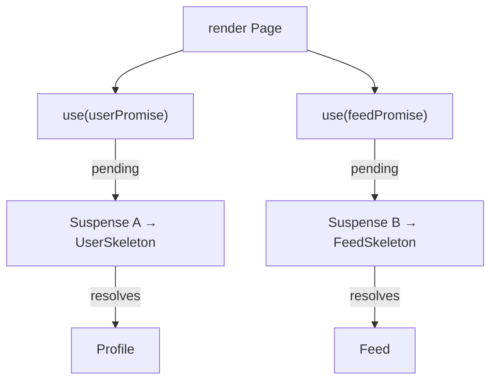

# Module 10: Suspense, Data Fetching & Server Components

<p class="module-hook">What if a component could just wait for data — or never reach the browser at all?</p>

> **The translation**
>
> **Vue intuition** → fetch in a lifecycle hook, toggle `isLoading`, and every component still ships to the client.
>
> **Why it breaks** → that is manual orchestration, and even SSR hydrates the whole tree in the browser.
>
> **React intuition** → `use()` reads a promise during render behind `<Suspense>`; Server Components run only on the server and ship zero JS.
>
> **Why it's built this way** → loading and error become declarative *boundaries*, and moving work to the server shrinks the client bundle.

The last pillar of React mastery is the declarative orchestration of async resources. Historically, fetching meant a `useEffect` that set loading state, awaited data, set data state, then rendered — *"useEffect soup"* — and waterfalls where children couldn't fetch until parents resolved.

## 1. `use()` + Suspense — Declarative Fetching

React 19's **`use()`** hook reads a resource — a Promise or Context — **during render**. Uniquely, it may be called **conditionally**, inside `if` or loops, intentionally bypassing the Rules of Hooks that bind `useState`/`useEffect`.

When you call `use(promise)` and the promise is unresolved, React **suspends** that subtree, bubbles up to the nearest **`<Suspense>`** boundary, and shows its `fallback`. When the promise resolves, React resumes rendering with the data. No `isLoading` booleans, no effect soup.

```jsx
function Profile({ userPromise }) {
  const user = use(userPromise)     // suspends until resolved
  return <h1>{user.name}</h1>
}

function Page({ userPromise }) {
  return (
    <Suspense fallback={<Skeleton />}>
      <Profile userPromise={userPromise} />
    </Suspense>
  )
}
```

*The loading state stops being data you manage and becomes a boundary you declare.*

## 2. Parallel Boundaries — Killing the Waterfall

Kick off multiple promises concurrently and drop each into its own `<Suspense>` boundary. Each boundary resolves independently as its data arrives, so the page never waits for the slowest call and there's no parent→child fetch waterfall.

```jsx
// Start BOTH fetches before rendering — no waterfall.
const userPromise = fetchUser(id)
const feedPromise = fetchFeed(id)

<Suspense fallback={<UserSkeleton />}><Profile userPromise={userPromise} /></Suspense>
<Suspense fallback={<FeedSkeleton />}><Feed feedPromise={feedPromise} /></Suspense>
```



## 3. Error Boundaries — the Other Declarative Boundary

Suspense turns *loading* into a boundary you declare; **error boundaries** do the same for *failure*. A render error in a subtree bubbles to the nearest error boundary, which swaps in fallback UI instead of unmounting the whole app — the React analog of Vue's `onErrorCaptured` / `errorCaptured` hook.

The catch for Vue devs: the built-in mechanism is still a **class component** (the only place `componentDidCatch` / `getDerivedStateFromError` live), so most teams reach for the tiny **`react-error-boundary`** package for a hooks-friendly API.

```jsx
import { ErrorBoundary } from 'react-error-boundary'

<ErrorBoundary fallback={<p>Something broke.</p>}>
  <Suspense fallback={<Skeleton />}>
    <Profile userPromise={userPromise} />
  </Suspense>
</ErrorBoundary>
```

Nest them deliberately: the **error** boundary catches a rejected promise or a render throw; the **Suspense** boundary catches the pending state. Together they replace the `try/catch` + `isError` + `isLoading` triad you'd hand-wire around a Vue fetch with two declarative wrappers. Mind the scope: like `onErrorCaptured`, an error boundary catches **render-phase** errors in its descendants — *not* errors thrown in event handlers or async callbacks, which you still handle imperatively.

*Vue funnels descendant errors through an `errorCaptured` lifecycle hook; React funnels them to a boundary component — same "catch below me, show fallback," different primitive.*

> **Self-Test:**
> You wrap a data component in both `<Suspense>` and an error boundary. The fetch rejects; then, separately, an `onClick` handler throws. Which failure does the error boundary catch, and which does it not? *(It catches the render-phase failure — a rejected promise read with `use()` throws during render and becomes fallback UI — but not the click handler's throw: event-handler and async errors escape error boundaries and must be caught imperatively, e.g. try/catch inside the handler.)*

## 4. Server Components vs. Vue SSR

The culmination is **React Server Components (RSC)**, championed by meta-frameworks like Next.js. Both Vue and React have long used **SSR** — render HTML on the server, hydrate on the client — and Nuxt 3 does this excellently via the Nitro engine's streaming.

RSC goes further than SSR. A Server Component executes **only on the server** and is **omitted from the client bundle** entirely. It can query a database or ORM directly and pass the result — often as a Promise — down to a Client Component, which reads it with `use()`. Interactive islands are marked with the **`"use client"`** directive.

```jsx
// Server Component — runs on the server, ships ZERO JS to the browser.
async function ProductPage({ id }) {
  const product = await db.product.findById(id)   // direct DB access
  return <ProductView product={product} />        // <ProductView> can be a client island
}
```

The payoff: **zero JavaScript** for static, data-heavy segments; the client bundle is reserved for genuinely interactive `"use client"` components. Where Vue's Vapor Mode (Module 4) shrinks the client bundle by dropping the VDOM runtime, RSC removes the client *execution* of data-fetching and formatting altogether — two different routes to "ship less to the browser."

| Data-architecture feature | Legacy React | Modern React 19 / RSC |
| :--- | :--- | :--- |
| **Fetch location** | Client, via `useEffect` | Server, via Server Components |
| **Loading state** | Manual `[isLoading, setIsLoading]` | Automatic via `<Suspense>` |
| **Data consumption** | Local state after effect resolves | Promises read during render via `use()` |
| **Bundle impact** | All fetch logic shipped to client | Zero-JS server components |
| **Parallelization** | Hard; waterfalls common | Simple; parallel Suspense boundaries |

> **Self-Test:**
> `use()` can be called inside an `if` or a loop, which would break `useState`. What property of `use()` makes conditional calling safe? *(`use()` doesn't rely on a stable hook call-order/index the way state hooks do — it reads a resource and integrates with Suspense/render suspension, so it isn't bound by the Rules of Hooks that exist to keep `useState`/`useEffect` calls positionally consistent across renders.)*

> **Self-Test:**
> A Vue dev says "RSC is just SSR." Give the one distinction that separates them. *(SSR renders components to HTML on the server but still ships their JS to hydrate on the client; a Server Component runs only on the server and is excluded from the client bundle entirely — zero JS for that component.)*

> **Self-Test:**
> Two independent fetches render sequentially and the page stalls on the slower one. How do `use()` and Suspense restructure this to remove the waterfall? *(Start both promises before rendering and place each consuming component in its own Suspense boundary, so they load in parallel and each boundary reveals its content as soon as its own promise resolves.)*
