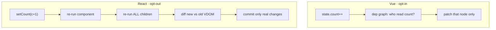

# Module 2: Reactivity Models & Rendering Triggers

<p class="module-hook">Where your Vue instincts quietly misfire.</p>

> **The translation**
>
> **Vue intuition** → change a reactive value and only the components that *read* it re-render.
>
> **Why it breaks** → React never tracked which data you read, so a state change re-renders the component and its whole subtree.
>
> **React intuition** → rendering is opt-*out*: you stop the unnecessary work with `React.memo` / `useMemo`, rather than opt in.
>
> **Why it's built this way** → with no runtime dependency graph, React re-runs and diffs instead of subscribing reads to writes.

Understanding precisely how React decides *what to update* is the single most important technical hurdle for a transitioning Vue developer. Both frameworks use a Virtual DOM to batch work before touching the costly real DOM — but their reconciliation strategies and re-render heuristics are diametrically opposed. The one sentence to internalize: **React is unaware of which data a component read.**

## 1. Vue's Compiler-Informed Granular Reactivity

Vue 3 pairs a compiler-informed Virtual DOM with a proxy-based reactive system. At build time, Vue's compiler analyzes each Single-File Component and separates static nodes from dynamic bindings. Static elements are **hoisted** — allocated once, reused forever, and skipped by diffing on every later update.

At runtime, reactivity is *opt-in at the render level*. Because state is wrapped in `Proxy`, Vue builds a precise dependency graph during a component's first render: read a reactive property and the component is recorded as a subscriber to *that* property. Mutate it later and Vue knows exactly which component — often which DOM node — must update. Components re-render only when their tracked data changes, with no developer intervention.

*Vue's default is surgical: reads subscribe, writes notify exactly their subscribers.*

## 2. React's Top-Down Snapshot Rendering

React's trigger is **opt-out**. It treats the UI as a pure function of state — `UI = f(state)` — and takes a *snapshot* each render. When a component's state changes via a setter, React re-renders that component **and its entire downward subtree** by default, assuming that if the parent's snapshot changed, children must be recomputed to check their output.

React does not know which variables a component actually rendered. It runs the function, builds a new Virtual DOM tree, and **diffs** it against the previous one to find what to commit. A "re-render" is that function-execution + diff — it does **not** imply a DOM mutation; the DOM is only touched where the diff finds a real change.

*Re-render ≠ repaint. React re-runs and re-diffs eagerly; it only commits the deltas.*



This top-down cascade is the source of React's "micro-performance" bottlenecks in dashboards and high-frequency UIs: the engine can burn milliseconds generating and diffing *identical* trees for children whose props never changed.

> **Self-Test:**
> A `<Parent>` holds `count`; it renders `<HeavyList items={items} />` where `items` never changes. You bump `count`. In Vue, `HeavyList` does not re-run. In React it re-runs every time — why, and does that guarantee the list's DOM is repainted? *(React re-executes the whole subtree because the parent rendered, regardless of which props changed; the DOM is **not** necessarily repainted — the diff finds `items` unchanged and commits nothing, but the wasted render + diff cost is real.)*

## 3. Halting the Cascade — Manual Memoization

Because React lacks Vue's dependency tracking, *you* opt children out of the cascade. Historically this was three tools, all about **referential stability**:

* **`React.memo(Component)`** — skip re-rendering when props are referentially equal to last time.
* **`useMemo(fn, deps)`** — cache a derived value so its reference is stable across renders.
* **`useCallback(fn, deps)`** — cache a function so a memoized child doesn't see a "new" prop every render.

```jsx
const HeavyList = React.memo(function HeavyList({ items, onPick }) { /* ... */ })

function Parent() {
  const [count, setCount] = useState(0)
  const [items] = useState(bigArray)

  // Without useCallback, onPick is a NEW function each render →
  // React.memo sees a changed prop → HeavyList re-renders anyway.
  const onPick = useCallback((id) => console.log(id), [])

  return (
    <>
      <button onClick={() => setCount((c) => c + 1)}>{count}</button>
      <HeavyList items={items} onPick={onPick} />
    </>
  )
}
```

For a Vue developer used to `computed` "just working," the explicit tracking of reference equality is the heaviest cognitive tax in React. It is exactly this tax that the **React Compiler** (Module 8) automates — and Vue's **Vapor Mode** (Module 4) attacks from the opposite direction by shrinking the runtime instead.

> **Self-Test:**
> A teammate wraps *every* value in `useMemo` "to be safe." Why can this be net-negative, and what is the actual precondition for `useMemo`/`React.memo` to help? *(Memoization has its own cost — the cache, the dependency comparison, and stored closures — so blanket use adds overhead with no benefit unless (a) the computation or subtree is genuinely expensive and (b) its inputs are referentially stable enough to hit the cache.)*
