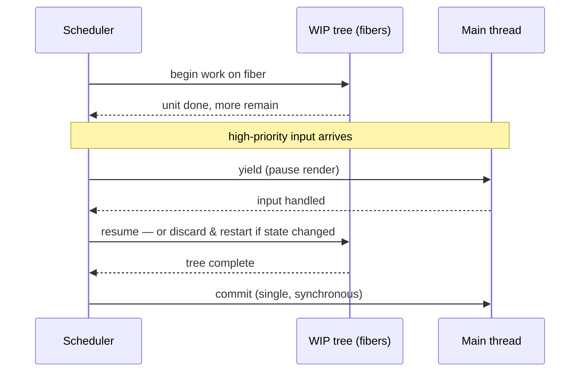

# Module 3: The Engine Room — Fiber Architecture vs. Vapor Mode

To grasp React's performance character you must go under reconciliation. The way each framework traverses its render output dictates how it handles heavy computational loads and stays interactive. React and Vue 3.5 make *opposite* bets: React optimizes the Virtual DOM with interruptible scheduling; Vue's Vapor Mode deletes the Virtual DOM.

## 1. React Fiber — Interruptible Reconciliation

React's reconciler was rewritten in v16 as **Fiber** to fix the legacy *stack reconciler*, which processed the component tree recursively on the JS call stack. If a large tree took longer than the ~16.67ms frame budget, it blocked the main thread — dropped frames, stuttering animation, unresponsive input.

Fiber restructures the work as data instead of a call stack:

* A **fiber node** is a plain JS object representing a component, its state, its props, and its DOM. React keeps two trees — the current one and a **work-in-progress (WIP)** tree.
* Fibers are linked in a **singly-linked list** (child → sibling → return), traversed parent-first, depth-first — *without* relying on the call stack.

Because traversal is decoupled from the stack, React can **pause** mid-tree, **yield** to the browser for a high-priority task (a keystroke), then **resume** — or **abort** the WIP tree entirely if newer state arrives. This *time-slicing* keeps input responsive even in huge apps by prioritizing interaction over deep DOM work.

*Fiber's win isn't threads — it's that render work became a resumable data structure the scheduler can interrupt.*

Note the split: **render** (building the WIP tree) is interruptible and can be thrown away; **commit** (applying it to the DOM) is a single synchronous, non-interruptible phase. That is why side effects belong in commit-phase hooks, not mid-render.

> **Self-Test:**
> The old stack reconciler could not pause a render; Fiber can. What single structural change made interruption possible? *(Modeling the tree as a linked list of fiber objects moved traversal state off the JS call stack and into data React controls, so it can stop after any unit of work and resume later.)*

## 2. Vue's Vapor Mode — Eradicating the VDOM

Where React optimizes the VDOM, Vue 3.5's **Vapor Mode** removes it. Inspired by Solid.js, it lets you opt performance-critical components out of the Virtual DOM entirely. The compiler emits **imperative DOM code** that targets specific nodes on reactive change — no VNode creation, no diffing, no VNode garbage to collect.

Reported results: memory usage down ~56% vs standard Vue 3.0, sub-1ms DOM patches, and up to ~36% DOM-manipulation gains. It also shrinks the baseline runtime.

## 3. The Footprint Comparison

Client-side runtime logic differs because the engines differ. Reported 2026 baselines:

| Engine characteristic | React (Fiber) | Vue 3.5 (VDOM + Vapor) |
| :--- | :--- | :--- |
| **Data structure** | Singly-linked list of fiber nodes | VNode tree; direct DOM bindings in Vapor |
| **Execution model** | Async, interruptible, prioritizable | Synchronous, granular patching |
| **Memory overhead** | Higher — current + WIP trees | Lower — Vapor cuts ~56% |
| **Baseline bundle** | ~32–40KB min | ~18–22KB min |

React's scheduling engine intrinsically needs more client runtime than Vue's compiler-driven approach; React 19's compiler runtime adds to that. The lesson is not "smaller is always faster" — Fiber buys *responsiveness under load* that a synchronous engine cannot — but it explains why identical apps ship different byte budgets.

*Two philosophies, one tradeoff axis: React spends bytes and memory to stay interruptible; Vapor spends compile-time cleverness to ship less runtime.*

> **Self-Test:**
> A Vue dev claims "the Virtual DOM is why Vue is fast." Correct the statement using Vapor Mode as evidence. *(The VDOM is an overhead the framework works to *minimize*, not a speed source; Vapor is faster precisely because it drops the VDOM and patches the DOM imperatively — the diffing step was a cost, not the benefit.)*

> **Self-Test:**
> During a long React render a user clicks a button. How can Fiber keep the click responsive, and what happens to the render work already done? *(The scheduler yields to handle the interaction; the in-progress WIP tree is paused and either resumed or discarded and restarted if the interaction changed state — none of it has been committed to the DOM yet, so discarding is safe.)*
