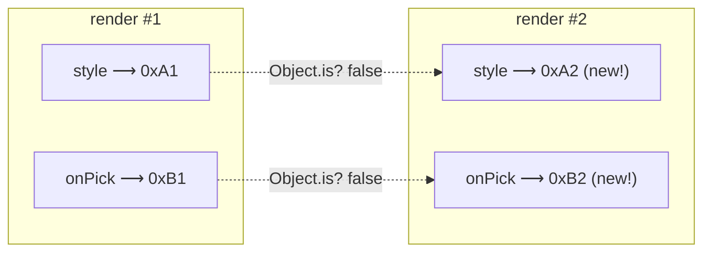

# Module 3: Identity & Equality — React's Load-Bearing Question

<p class="module-hook">React doesn't ask what changed. It asks: is it the same object?</p>

> **The translation**
>
> **Vue intuition** → the proxy tracks property access, so you rarely think about object identity.
>
> **Why it breaks** → React has no such graph; it asks one cheap question — "the same reference as last render?"
>
> **React intuition** → keys, `React.memo`, dependency arrays, and immutable updates are all that single check in disguise.
>
> **Why it's built this way** → a reference comparison is O(1) and needs zero bookkeeping — change detection that scales.

Module 2 established that React is unaware of *which data* a component read. That single fact has a consequence worth its own module: with no dependency graph to consult, React falls back on the only cheap question it can ask at almost every decision point — **"is this the same reference as last time?"** Memoization, dependency arrays, immutable state, and list reconciliation are not four unrelated rules. They are that one question wearing four costumes.

Vue rarely makes you think about identity because its proxy **tracks property access**: read `user.name` and Vue knows, at the property level, exactly what changed. React has no such tracking, so it leans on **reference identity** instead. Internalize this module and the rest of the course stops being a checklist and becomes a single idea applied repeatedly.

## 1. Reference Equality — React's One Comparison

JavaScript compares **primitives by value** and **objects, arrays, and functions by reference**. React's change detection is built directly on this via `Object.is` (roughly `===`, with saner `NaN`/`-0` handling):

```js
Object.is(2, 2)            // true  — primitives compare by value
Object.is('a', 'a')       // true
Object.is({}, {})         // false — two distinct references
Object.is([1], [1])       // false
const f = () => {}
Object.is(f, f)           // true  — same reference
Object.is(() => {}, () => {}) // false — two functions, two identities
```

Two places React runs this comparison for you:

* **State bailout** — call a setter with a value `Object.is`-equal to the current one and React skips the re-render entirely. `setUser(user)` with the *same* object does nothing; `setUser({ ...user })` renders.
* **Shallow prop comparison** — `React.memo` compares each prop with `Object.is`. One prop that is a *new* reference (even with identical contents) defeats the memo.

*Vue asks "which property changed?"; React asks "is this the same reference?" Every rule below is a corollary of that swap.*

## 2. Every Render Mints New Identities

Because a React component is a function that **re-runs top to bottom every render** (Module 2), every object, array, and function *literal* in its body is allocated fresh — a **new identity** — on each render.

```jsx
function Parent({ q }) {
  // All three are BRAND NEW references on every render:
  const style = { color: 'red' }            // new object
  const items = data.filter(d => d.q === q)  // new array
  const onPick = (id) => track(id)           // new function
  return <Child style={style} items={items} onPick={onPick} />
}
```

Even if `Child` is wrapped in `React.memo`, it re-renders every time `Parent` does — the shallow compare sees three "changed" props because their references differ. This is the *same* phenomenon behind Module 2's `useMemo`/`useCallback` and Module 5's dependency arrays: they exist to **pin an identity** across renders so React's reference check can succeed.



Contrast Vue: `setup()` runs **once**, so the handler and reactive refs you define keep a stable identity for the component's lifetime. Vue simply never re-allocates them, so the question never arises.

> **Self-Test:**
> A component passes a fresh inline object each render — `style={ {color: 'red'} }` — to a `React.memo`'d child; the color never changes, yet the child re-renders on every parent render. Why, and what are two fixes? *(The object literal is a new reference each render, so memo's shallow `Object.is` compare sees a "changed" prop. Fix by pinning the identity: hoist the constant object above the component, or wrap it in `useMemo(() => ({ color: 'red' }), [])` — or let the React Compiler (Module 8) do it.)*

## 3. Component Identity — Keys, Remount vs. Reuse

Identity is not only about props; it governs **which component instance is which** across renders. When React reconciles a list of children, it pairs old and new by **position, element type, and `key`**. The `key` is your declaration of *logical identity*: "this element is the same item as the one with this key last render."

* **Same key across renders → reuse.** React keeps the existing instance, its state, its DOM, its focus — and only updates props.
* **Changed key → remount.** React unmounts the old instance (losing its state) and mounts a fresh one.

This is why the **array index is a trap as a key**. On reorder, insert, or delete, the indices stay `0..n` glued to *slots*, not *data* — so React reuses each instance in place and merely swaps its props. Any state that lives in the instance (edited text, focus, an uncontrolled input, animation) stays bound to the slot and visibly attaches to the wrong row.

```jsx
// ❌ index key: after reordering, row state sticks to the position, not the todo
{todos.map((t, i) => <TodoRow key={i} todo={t} />)}

// ✅ stable identity: React moves each instance WITH its state
{todos.map((t) => <TodoRow key={t.id} todo={t} />)}
```

The same mechanism is a tool when you invert it — **change a key on purpose to reset state**:

```jsx
// Remount the editor (clear its internal draft) whenever the selected id changes.
<ProfileEditor key={selectedId} userId={selectedId} />
```

*A key is not decoration to hush a warning — it is the identity contract that decides whether React preserves an instance or throws it away.*

> **Self-Test:**
> A reorderable list uses `key={index}`. You edit row 0's text, then drag it to the bottom; the edit appears on the *wrong* row. What did React do, and what fixes it? *(React pairs children by position+key; with index keys the keys stay `0..n` by slot, so React reuses the instances in place and only swaps props — the edited state stays with slot 0. Use a stable unique id (`key={row.id}`) so React moves each instance, with its state, to the new position.)*

## 4. Structural Sharing — Identity as the Change Signal

Since React detects change by reference (§1), signalling "something changed" means **producing a new reference for what changed** — and, to stay cheap, **reusing the references of everything that didn't**. That reuse is **structural sharing**.

```js
// Change one todo's `done` flag, immutably.
const next = {
  ...state,                                   // new root object
  todos: state.todos.map(t =>                 // new array
    t.id === id ? { ...t, done: !t.done }     // new object for the ONE that changed
                : t),                          // every other todo: SAME reference, shared
}
```

Only the **spine** from the root to the changed node is re-created; sibling subtrees keep their identity. That is exactly what lets memoized siblings and selector-based subscriptions (Module 6) *not* re-render: their inputs are `Object.is`-equal to last time. It is also why `state.todos.push(t)` renders nothing — same array reference — while returning a new array renders.

Vue takes the opposite route: you **mutate the proxy** (`todos.push(t)`), and property-level tracking notifies precisely the subscribers. No new reference is required because Vue never asks the reference question.

## 5. One Axis Behind Everything

Nearly every "React rule" a Vue developer collects is the identity question in disguise:

| React chore | The identity question it's really asking | Where it's applied |
| :--- | :--- | :--- |
| `React.memo` bailout | Are my props the *same references* as last render? | Module 2 |
| `useMemo` / `useCallback` | Keep this value's *identity* stable across renders | Module 2 |
| `useEffect` dependency array | Did a dependency's *reference* change? | Module 5 |
| Store setter triggers a render | Did I return a *new reference*? | Module 6 |
| List `key` — reuse vs. reset | Is this the *same logical element*? | this module |
| Compiler referential stability | Hold identities steady so consumers hit cache | Module 8 |

Vue made identity invisible by tracking reads; React promoted it to the load-bearing question of the whole model. Every later module leans on this one — so when a memo won't stick, an effect fires too often, or a store update renders nothing, ask first: *did the reference actually change the way I think it did?*

> **Self-Test:**
> In one sentence, name the single question that unifies `React.memo`, the `useEffect` dependency array, a Zustand setter, and a list `key`. *(All four ask "is this the same reference/identity as last time?" — memo asks it of props, deps of dependencies, the setter must answer "no" by returning a new reference, and keys ask it of list elements to decide reuse vs. remount.)*
