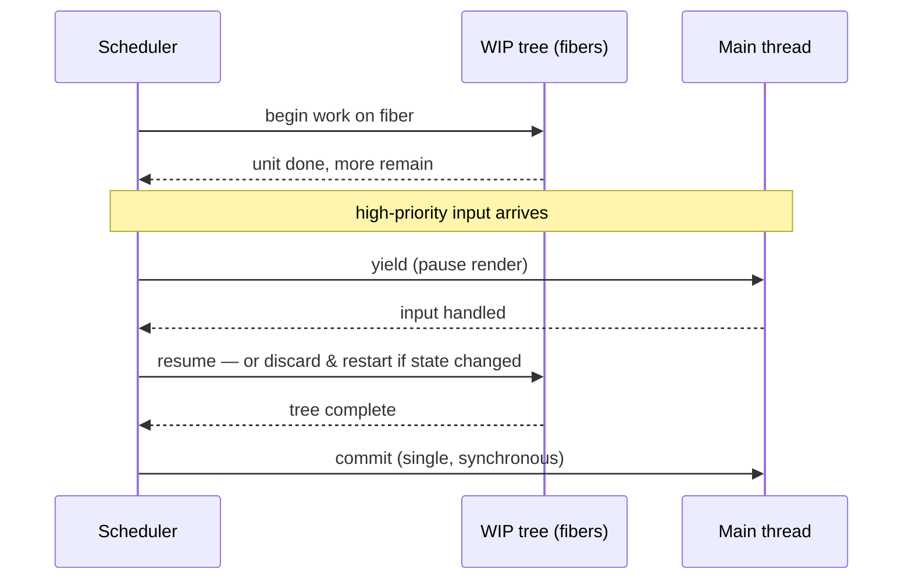

# Module 4: The Engine Room — Fiber Architecture vs. Vapor Mode

<p class="module-hook">How can React pause a render halfway through — while Vue drops rendering altogether?</p>

To grasp React's performance character you must go under reconciliation. The way each framework traverses its render output dictates how it handles heavy computational loads and stays interactive. React and Vue make *opposite* bets: React optimizes the Virtual DOM with interruptible scheduling; Vue's Vapor Mode deletes the Virtual DOM.

## 1. React Fiber — Interruptible Reconciliation

React's reconciler was rewritten in v16 as **Fiber** to fix the legacy *stack reconciler*, which processed the component tree recursively on the JS call stack. If a large tree took longer than the ~16.67ms frame budget, it blocked the main thread — dropped frames, stuttering animation, unresponsive input.

Fiber restructures the work as data instead of a call stack:

* A **fiber node** is a plain JS object representing a component, its state, its props, and its DOM. React keeps two trees — the current one and a **work-in-progress (WIP)** tree.
* Fibers are linked as a **linked-list tree** — each fiber points to its first child, its next sibling, and its `return` (parent) — traversed parent-first, depth-first *without* relying on the call stack.

Because traversal is decoupled from the stack, React can **pause** mid-tree, **yield** to the browser for a high-priority task (a keystroke), then **resume** — or **abort** the WIP tree entirely if newer state arrives. This *time-slicing* keeps input responsive even in huge apps by prioritizing interaction over deep DOM work.

*Fiber's win isn't threads — it's that render work became a resumable data structure the scheduler can interrupt.*



Note the split: **render** (building the WIP tree) is interruptible and can be thrown away; **commit** (applying it to the DOM) is a single synchronous, non-interruptible phase. That is why side effects belong in commit-phase hooks, not mid-render.

> **Self-Test:**
> The old stack reconciler could not pause a render; Fiber can. What single structural change made interruption possible? *(Modeling the tree as a linked list of fiber objects moved traversal state off the JS call stack and into data React controls, so it can stop after any unit of work and resume later.)*

## 2. The User-Facing Side of Interruptibility

Fiber's ability to pause and reprioritize is invisible until you *mark* work as interruptible. Two hooks expose it — and Vue, with its synchronous, fine-grained updates, has no direct analog.

* **`useTransition`** marks a state update as **non-urgent**. React renders it on a low-priority lane that urgent updates (typing, clicks) can interrupt, and gives you an `isPending` flag while it works.
* **`useDeferredValue`** lets a value **lag behind** its source: React keeps showing the previous result while it prepares the expensive update in the background.

```jsx
function Search() {
  const [input, setInput] = useState('')
  const [results, setResults] = useState([])
  const [isPending, startTransition] = useTransition()

  function onType(next) {
    setInput(next)                        // urgent: the input stays responsive
    startTransition(() => {               // non-urgent, interruptible
      setResults(expensiveFilter(next))
    })
  }
  return (
    <>
      <input value={input} onChange={(e) => onType(e.target.value)} />
      {isPending && <Spinner />}
      <List items={results} />
    </>
  )
}

// Declarative alternative — let a value lag while the heavy tree catches up:
const deferred = useDeferredValue(input)
const list = useMemo(() => expensiveFilter(deferred), [deferred])
```

In Vue you would reach for manual `debounce`/`throttle` or `nextTick` scheduling to keep typing smooth. React instead lets the **scheduler** interleave the urgent keystroke render ahead of the heavy list render — the §1 time-slicing, now under your control. The shift: you don't defer *time* (a timer), you defer *priority* (a lane the scheduler can preempt).

*Vue keeps the frame responsive by updating less; React keeps it responsive by reordering when work runs.*

> **Self-Test:**
> A search box janks while filtering 10k rows on every keystroke. What do `useTransition` / `useDeferredValue` do that a `setTimeout` debounce does not? *(They don't delay the work by a fixed time — they render it at a lower priority the scheduler can interrupt and restart, so the urgent keystroke render always preempts the in-flight list render; the input never waits on a timer, and stale list work is abandoned and restarted as you keep typing.)*

## 3. Vue's Vapor Mode — Eradicating the VDOM

Where React optimizes the VDOM, Vue's **Vapor Mode** removes it. Inspired by Solid.js, it lets you opt performance-critical components out of the Virtual DOM entirely: the compiler emits **imperative DOM code** that targets specific nodes on reactive change — no VNode creation, no diffing, no VNode garbage to collect. That trims both memory and patch time and shrinks the baseline runtime.

Vapor is **experimental and opt-in** — it is *not* part of Vue 3.5 and is landing incrementally in a later minor, so treat concrete benchmarks as preliminary. (Independently, Vue 3.5's **reactivity refactor** already cut memory usage **~56%** with no behavior change — a core-wide win that is *not* Vapor.)

## 4. The Footprint Comparison

Client-side runtime logic differs because the engines differ. Approximate, order-of-magnitude baselines (not official figures):

| Engine characteristic | React (Fiber) | Vue 3.x (VDOM; Vapor experimental) |
| :--- | :--- | :--- |
| **Data structure** | Linked-list tree of fiber nodes | VNode tree; direct DOM bindings in Vapor |
| **Execution model** | Async, interruptible, prioritizable | Synchronous, granular patching |
| **Memory overhead** | Higher — current + WIP trees | Lower — 3.5 reactivity cut ~56% |
| **Baseline bundle** | Larger — ships a scheduler runtime | Smaller — compiler-driven |

React's scheduling engine intrinsically needs more client runtime than Vue's compiler-driven approach; React 19's compiler runtime adds to that. The lesson is not "smaller is always faster" — Fiber buys *responsiveness under load* that a synchronous engine cannot — but it explains why identical apps ship different byte budgets.

*Two philosophies, one tradeoff axis: React spends bytes and memory to stay interruptible; Vapor spends compile-time cleverness to ship less runtime.*

> **Self-Test:**
> A Vue dev claims "the Virtual DOM is why Vue is fast." Correct the statement using Vapor Mode as evidence. *(The VDOM is an overhead the framework works to *minimize*, not a speed source; Vapor is faster precisely because it drops the VDOM and patches the DOM imperatively — the diffing step was a cost, not the benefit.)*

> **Self-Test:**
> During a long React render a user clicks a button. How can Fiber keep the click responsive, and what happens to the render work already done? *(The scheduler yields to handle the interaction; the in-progress WIP tree is paused and either resumed or discarded and restarted if the interaction changed state — none of it has been committed to the DOM yet, so discarding is safe.)*
