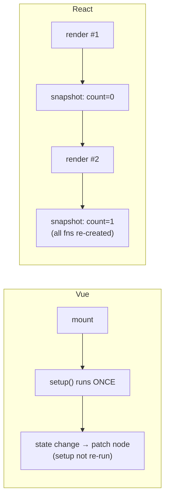

# Module 4: Component Logic, Closures & Execution Semantics

Vue Composables and React Hooks both extract reusable stateful logic — and that surface similarity is a trap. Their execution semantics and memory models are entirely different, and the gap is where the most insidious React bugs live.

## 1. Setup Once vs. Render Every Time

In Vue, `<script setup>` (or `setup()`) is a **one-time initialization** phase. On mount it runs exactly once: it establishes reactive bindings, registers lifecycle hooks like `onMounted`, and defines helper functions. Those functions close over **stable reactive refs**. When state changes, Vue does *not* re-run setup — it triggers the minimal DOM update. You rarely think about closures or per-render allocation.

React components are ordinary functions that execute **top to bottom on every render**. Five hooks and three helpers? All of them re-evaluate and re-allocate every render. The variables inside are a **frozen snapshot** of the state for *that specific render frame*.

```jsx
function Counter() {
  const [count, setCount] = useState(0)
  // A NEW `handleClick` closure is created every render,
  // each closing over the `count` value frozen into ITS render.
  const handleClick = () => console.log('count was', count)
  return <button onClick={() => { setCount(count + 1); handleClick() }}>{count}</button>
}
```

*Vue: define once, refs stay live. React: re-run each render, every value is a snapshot.*



## 2. The Stale Closure — React's Signature Bug

Because every render freezes its own snapshot, any callback that **outlives its render** — a `setTimeout`, an event listener, an async `fetch` handler — keeps pointing at the state from the frame it was born in.

```jsx
function Timer() {
  const [count, setCount] = useState(0)

  useEffect(() => {
    // Runs once (empty deps). This closure captured count = 0 forever.
    const id = setInterval(() => setCount(count + 1), 1000) // ❌ always 0 + 1
    return () => clearInterval(id)
  }, [])

  return <p>{count}</p> // sticks at 1
}
```

Two correct fixes:

```jsx
// Fix A — functional update: don't read the stale snapshot at all.
setInterval(() => setCount((c) => c + 1), 1000)

// Fix B — declare the dependency so the effect re-subscribes with a fresh closure.
useEffect(() => {
  const id = setInterval(() => setCount(count + 1), 1000)
  return () => clearInterval(id)
}, [count])
```

Vue's automatic dependency tracking and stable refs eliminate this entire class of bug — which is exactly why it blindsides transitioning developers.

> **Self-Test:**
> The `Timer` above logs `1` forever. Name the mechanism and say which fix avoids re-subscribing the interval on every tick. *(A stale closure: the `[]`-deps effect captured `count = 0` once. The functional update `setCount(c => c + 1)` fixes it **without** re-subscribing, because it never reads the captured value; adding `count` to deps also works but tears down and recreates the interval each change.)*

## 3. Side Effects — `watchEffect` vs `useEffect`

`useEffect` synchronizes a component with an external system (network, subscriptions, direct DOM). Because the component re-runs continuously, React needs an explicit **dependency array** to decide whether to re-run the effect:

* Omit a used variable → the effect won't re-run when it changes → desynchronized UI.
* Omit the array entirely → it runs after *every* render → often an infinite loop.

Vue abstracts the danger. `watch` separates the dependency declaration from the callback and hands you old/new values. `watchEffect` is self-managing — it runs immediately, records every reactive property accessed **during that synchronous execution**, and subscribes to them automatically.

```js
// Vue: dependency auto-tracked
watchEffect(() => { document.title = `Count: ${count.value}` })
```
```jsx
// React: dependency declared by hand
useEffect(() => { document.title = `Count: ${count}` }, [count])
```

The critical caveat cuts both ways: **`watchEffect` only tracks synchronously.** Any reactive property read *after* an `await` is not tracked — the execution context yielded to the microtask queue and detached from Vue's tracking scope. React's model is blunter but explicit: what's in the array is the contract.

```js
watchEffect(async () => {
  const a = source.value          // ✅ tracked
  await delay(100)
  const b = alsoSource.value      // ❌ NOT tracked — runs after the await
})
```

## 4. Utility Ecosystems

Both worlds ship composable utility libraries for browser APIs, storage, and observers: **VueUse** for Vue, **ReactUse** for React. They solve identical problems but each obeys its framework's reactivity model — VueUse returns reactive refs; ReactUse returns snapshotted values and follows the Rules of Hooks.

> **Self-Test:**
> A Vue dev moves a `watchEffect` data-fetch to React's `useEffect` and forgets the dependency array. Describe the two failure modes by array state — empty vs absent. *(Empty `[]`: the effect runs once and never re-fetches when inputs change, so the UI goes stale. Absent: it runs after every render, and if the effect sets state it triggers another render → an infinite fetch loop.)*

> **Self-Test:**
> Why does `watchEffect` fail to track a ref read after `await`, and how does `watch` sidestep the problem? *(`watchEffect` collects dependencies only during its synchronous pass; after `await` the tracking scope is gone. `watch` takes an explicit source, so the dependency is declared up front rather than discovered during execution.)*
